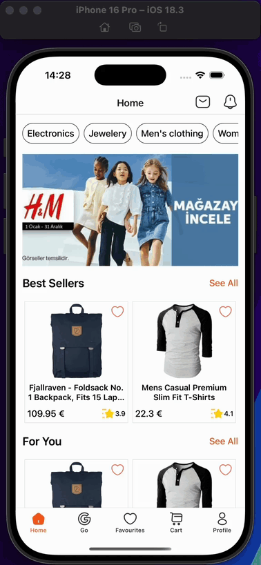
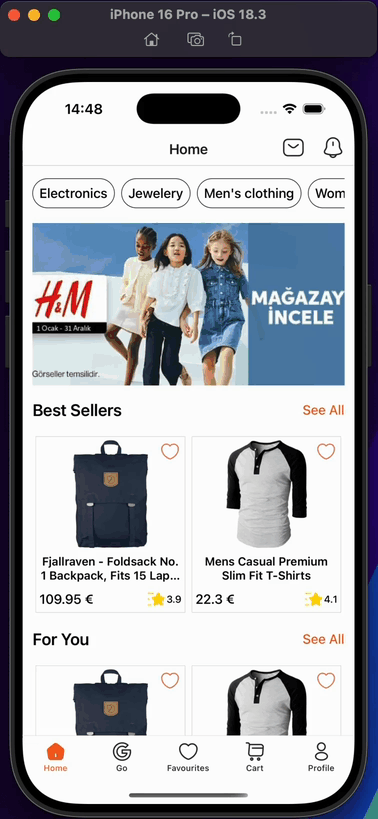

<h1>Trendyol Clone App</h1>

This project is a clone of Trendyol, an e-commerce application developed with React Native. Application consists of a home page and a products page. Users can view products, sales, campaigns and widgets on the home page. They can view category products on the products page. They can also view product detail on the product detail page.

<h2>Used Technologies</h2>

<ul>

<li>@react-navigation/native</li>
<li>@react-navigation/native-stack</li>
<li>@react-navigation/bottom-tabs</li>
<li>@reduxjs/toolkit</li>
<li>react-redux</li>
<li>axios</li>
<li>iconsax-react-native</li>
<li>react-native-bootsplash</li>
<li>react-native-safe-area-context</li>
<li>react-native-screens</li>
<li>react-native-svg</li>

</ul>

<h1>Screen Gifs</h1>

